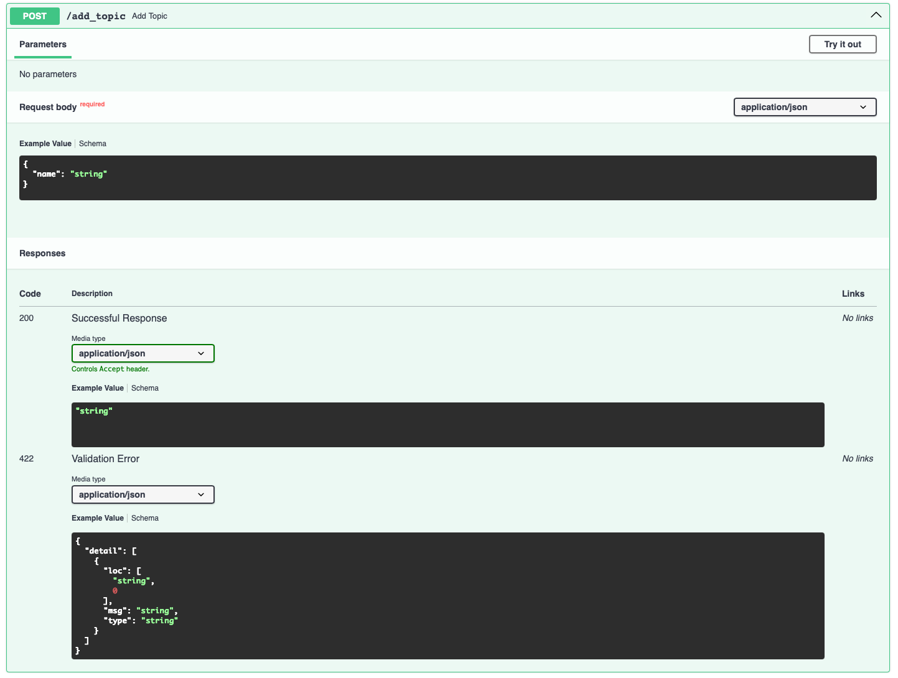
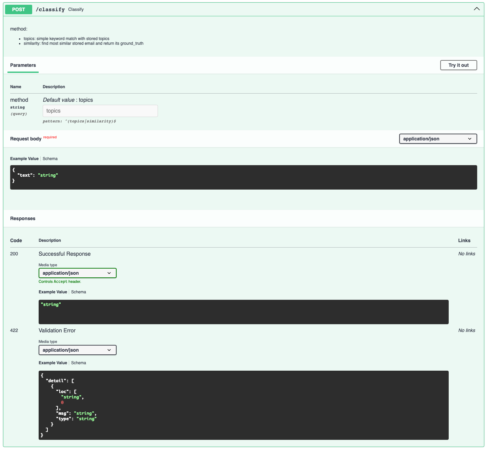
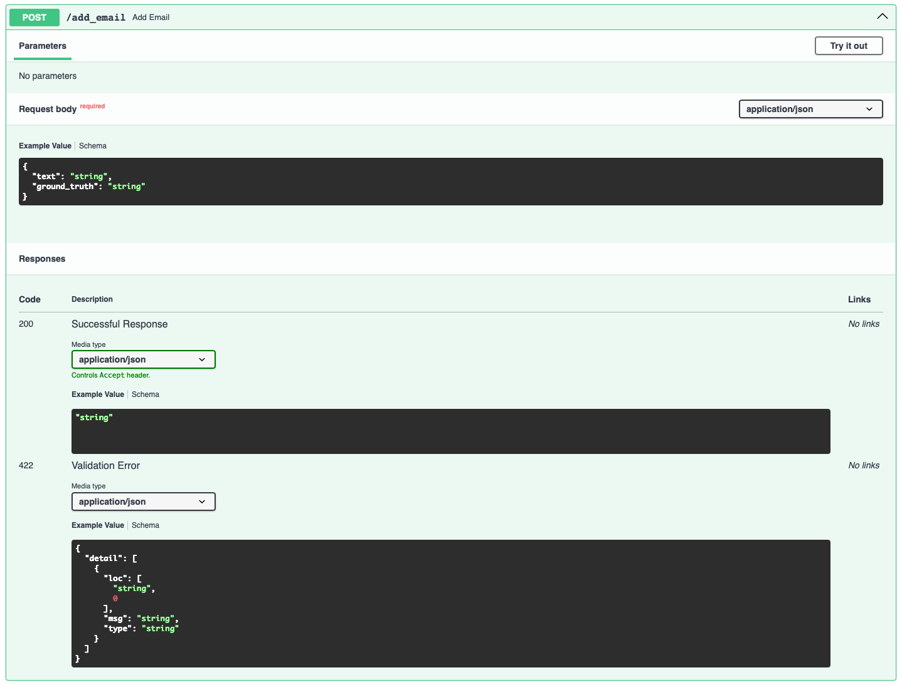
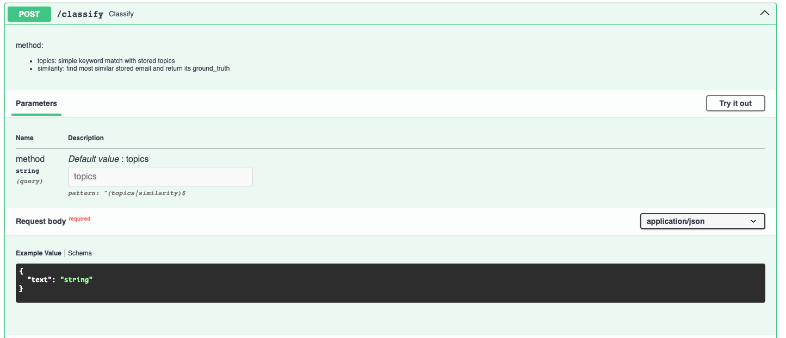

# Lab 2 Factories — Homework Submission

## Repo
Fork used: https://github.com/mlops-stthomas/lab2_factories  
My fork / submission: https://github.com/manojmmenon/lab2_factories

## What I added
- `/add_topic` — add new topics stored in `topics.json`.
- `/add_email` — store emails with optional `ground_truth` in `emails.json`.
- `/classify` — supports `method=topics` (keyword matching) and `method=similarity` (TF-IDF similarity against stored emails).

## How to run
1. Clone repo and create venv:
git clone https://github.com/
<your-username>/lab2_factories.git
cd lab2_factories
python -m venv .venv
source .venv/bin/activate # or Windows activate
pip install -r requirements.txt
uvicorn main:app --reload

2. Open Swagger UI: `http://127.0.0.1:8000/docs`

## Demonstrations (screenshots)
1. Add topic (Finance)  

2. Classify by topic  

3. Add an email with ground truth (Finance)  

4. Classify by similarity (returns "Finance" from similar stored email)  

## Notes
- Stored JSON files: `topics.json`, `emails.json`
- If you keep repo private, add my GitHub account as collaborator to share:
- Go to your repo -> Settings -> Manage access -> Invite collaborator -> `jhoward`

